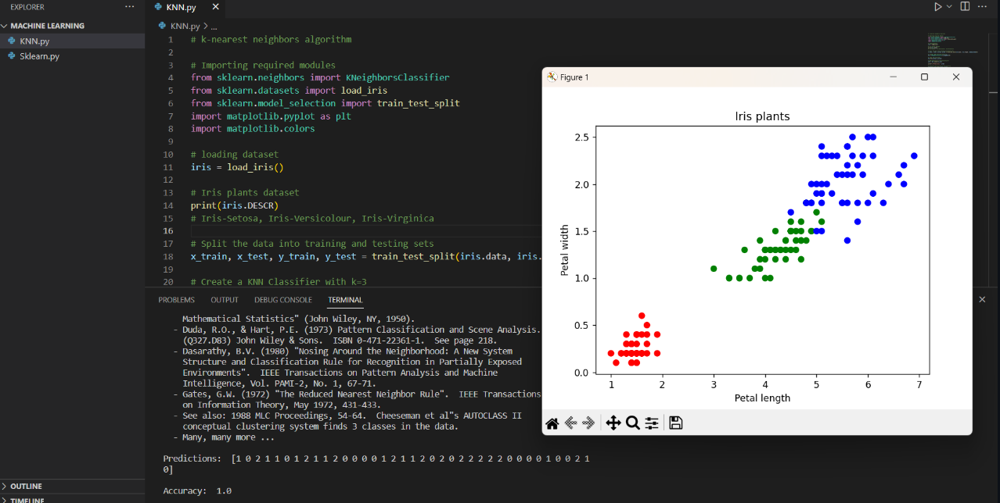

### The red, green, and blue colors in the scatter plot represent the three different classes of iris plants in the dataset. In this case, red represents Iris Setosa, green represents Iris Versicolor, and blue represents Iris Virginica. When we pass the iris.target array to the c parameter of the plt.scatter() function, it assigns a different color to each class of iris plant. The matplotlib.colors.ListedColormap() function creates a colormap that maps each class to a specific color. By visualizing the data in this way, we can see how the different classes are distributed in the feature space and how well they are separated by the features being used in the KNN algorithm.