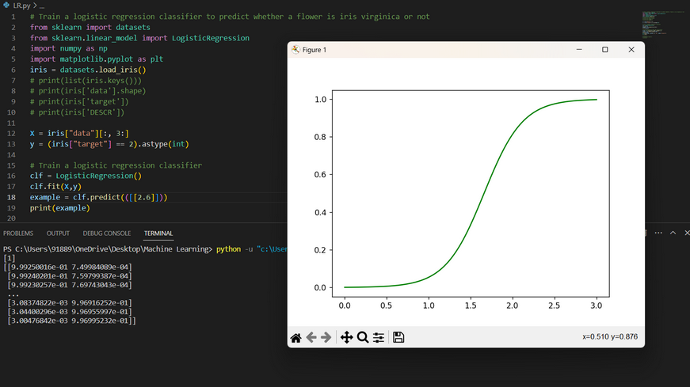

## The graph shows the probability of a flower being iris virginica based on its petal width. The x-axis shows the petal width values and the y-axis shows the probability values ranging from 0 to 1. The green line in the graph represents the probability of a flower being iris virginica. As you can see, the probability increases as the petal width increases. This means that a flower with a larger petal width is more likely to be iris virginica than a flower with a smaller petal width. The point where the green line crosses the 0.5 probability threshold (indicated by the dashed horizontal line) is around 1.6 on the x-axis. This means that if a flower has a petal width of 1.6 or greater, it is more likely to be iris virginica than not. Conversely, if a flower has a petal width less than 1.6, it is more likely to not be iris virginica than to be iris virginica. Overall, this graph shows the relationship between petal width and the probability of a flower being iris virginica, and can be used to make predictions about new flowers based on their petal width.